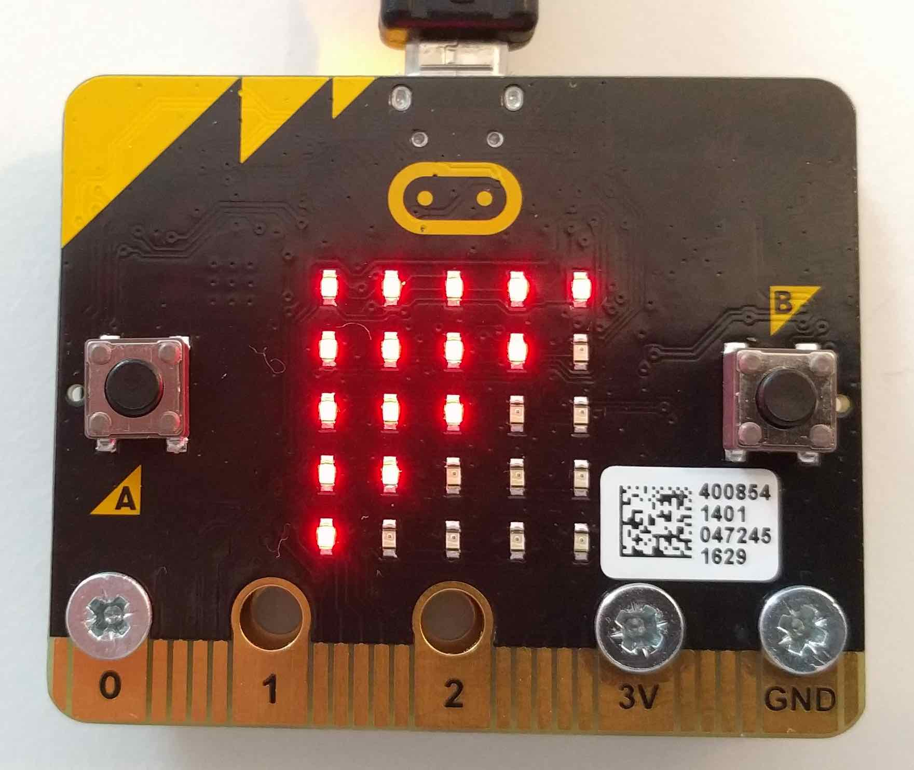
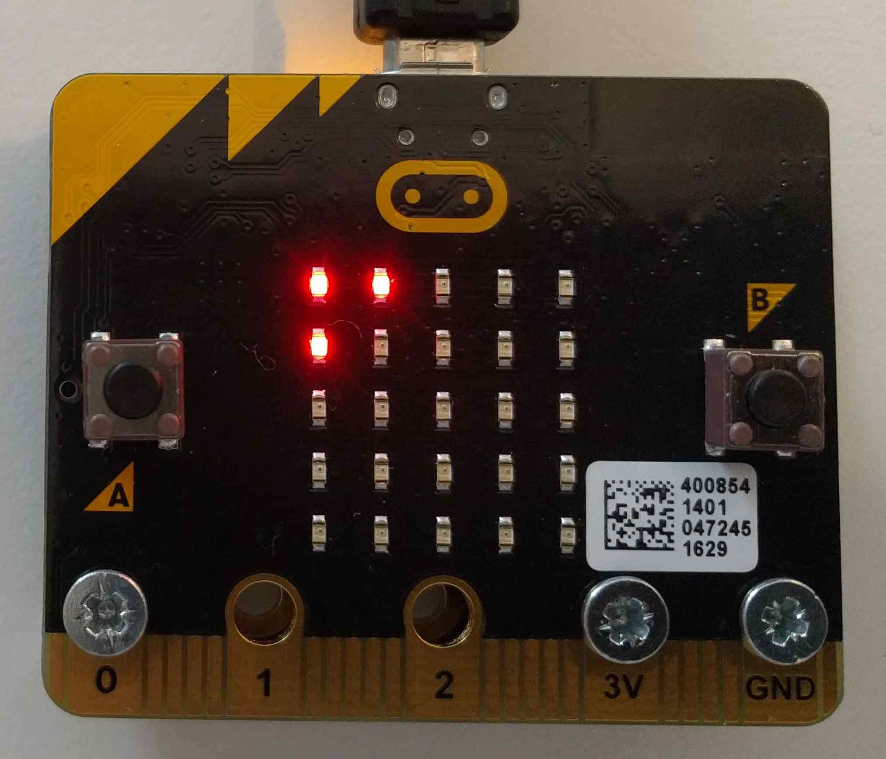

# microbit-physicalweb

A Physical Web beacon for the microbit with some easy to use controls for changing broadcast power. Once you've flashed your microbit, the display will light up with a scrolling marquee and start broadcasting a Physical Web url. The following controls are provided:

* **Press A** to decrease the broadcast power
* **Press B** to increase the broadcast power
* **Turn the device upside down** to turn off the display

We use this code to broadcast urls generated from https://show.io and the url can be easily changed if building from source.

[Watch a demo](https://www.youtube.com/watch?v=HtzFkxFJldE) of the code in action when downloading from Show.io...

[](https://www.youtube.com/watch?v=HtzFkxFJldE)


<div>



</div>


# Try it out

A prebuilt hex file is available which broadcasts the link to this repository. [Download the hex](https://github.com/showio/microbit-physicalweb/tree/master/example) and take the code for a spin!

# Changing URL & Building from Source

To change the broadcasted url or intro text, simply change the `URL` and `INTRO` variables at the top of the `main.ccp` file, compile your code and flash it to your microbit!

```cpp
-- char INTRO[] = "SHOW.IO";
-- char URL[] = "https://show.io/Fq5sf7O9Y";

++ char INTRO[] = "HELLO WORLD";
++ char URL[] = "https://microbit.co.uk";
```
